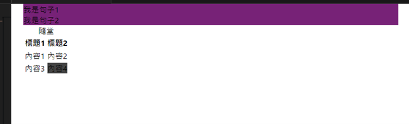

# 第1次隨堂-隨堂-QZ1
>
>學號：111111211
> 
>姓名：李俊威
> 
>作業撰寫時間：30 (mins，包含程式撰寫時間)
> 
>最後撰寫文件日期：2023/11/05
>

本份文件包含以下主題：(至少需下面兩項，若是有多者可以自行新增)
- [x] 說明內容
- [x] 個人認為完成作業須具備觀念

## 說明程式與內容

利用css中的"background-color: ;"語法改變背景顏色，由於題目設定"table"中的"div"不須改變，所以我使用了"inherit"讓"table"中的"div"保持原始的背景顏色。
以下為練習圖片：

## 個人認為完成作業須具備觀念

本次的隨堂作業複習了大一下學期的網頁設計課程中所教的背景"background-color: ;"語法，且搭配標籤的指定，讓複習不只是單一的背景，而是可以多層次的去學習，使操作更加熟悉，以助於日後職場使用。